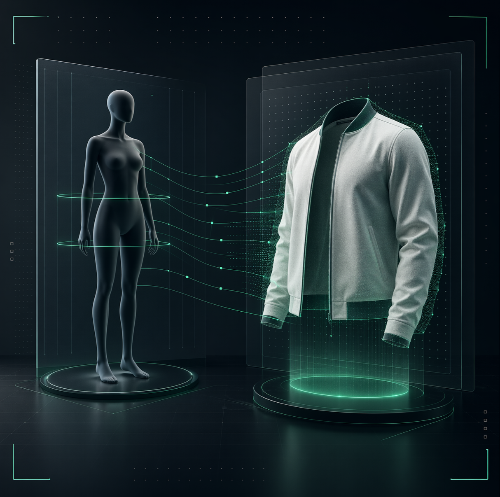
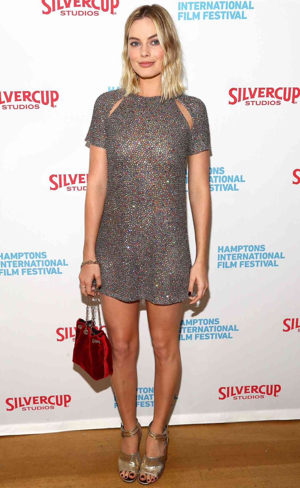
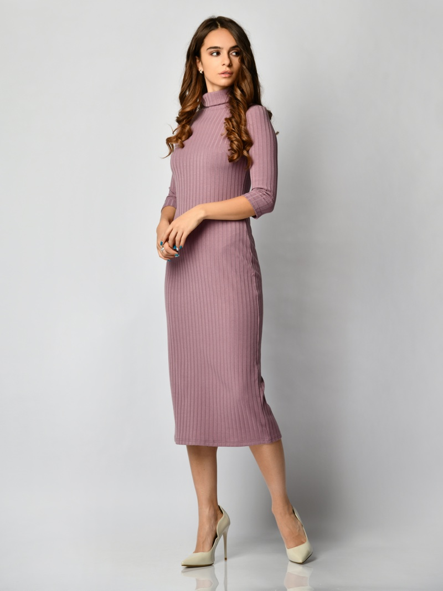
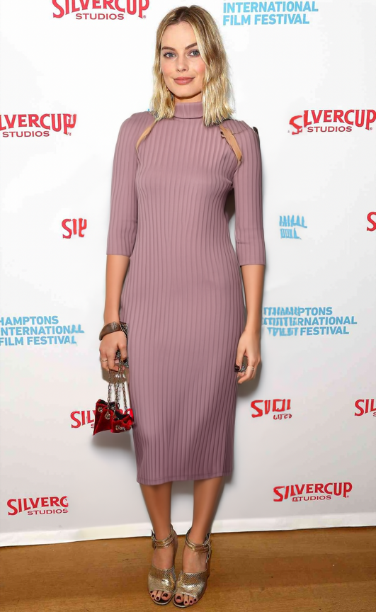

# 🧥 Precision VTON: Virtual Apparel Mapping Engine



> **Precision virtual fitting that feels ready for a fashion launch.**  
> Transform a model reference and a flat-lay garment into a high-fidelity virtual try-on preview in seconds.

---

## ✨ The Vision
Precision VTON is a production-grade virtual try-on system. It leverages the **FASHN VTON 1.5** neural engine to map fabric, form, and lighting into a clean composite preview built for modern commerce workflows.

### 🎥 Demo Sequence
| **1. Model Reference** | **2. Apparel Input** | **3. Rendered Output** |
|:---:|:---:|:---:|
|  |  |  |

---

## 🚀 Key Features

- **Neural Engine v4.0:** Advanced diffusion-based mapping for realistic fabric drape and lighting.
- **Multi-Category Support:** Specialized processing for `Tops`, `Bottoms`, and `One-pieces`.
- **Hybrid Input Types:** Support for both `Flat-lay` floor shots and `Model-worn` apparel references.
- **Glassmorphic UI:** A premium, responsive interface with smooth micro-animations and dark/light mode support.
- **GPU Optimized:** Backend support for CUDA and ONNX runtime for rapid inference.

---

## 🛠️ Tech Stack

**Frontend:**
- [React](https://reactjs.org/) + [Vite](https://vitejs.dev/)
- Vanilla CSS (Custom Design System)
- Framer Motion style reveals

**Backend:**
- [FastAPI](https://fastapi.tiangolo.com/) (High-performance Python API)
- [PyTorch](https://pytorch.org/) (Model inference)
- [FASHN VTON 1.5](https://github.com/fashn-AI/fashn-vton-1.5)

---

## 📂 Project Structure

```text
VirtualTryOn/
├── frontend/           # React + Vite application
│   ├── src/
│   │   ├── assets/     # Demo images and UI icons
│   │   ├── App.jsx     # Main UI logic
│   │   └── App.css     # Premium styling
└── backend/            # FastAPI + AI Model server
    ├── app.py          # API implementation
    ├── pyproject.toml  # Dependency manifest
    └── weights/        # AI model checkpoints
```

---

## 🔧 Installation & Setup

### 1. Backend Setup
```bash
cd backend
# Create and activate virtual environment
python3 -m venv venv
source venv/bin/activate

# Install dependencies
pip install -e .
pip install fastapi uvicorn python-multipart

# Start the server
python app.py
```

### 2. Frontend Setup
```bash
cd frontend
# Install dependencies
npm install

# Start the development server
npm run dev
```

---

## 🖱️ Usage

1.  **Upload Model:** Drop a clear photo of the person or mannequin.
2.  **Upload Apparel:** Drop a high-quality photo of the garment.
3.  **Configure:** Select the category (Tops/Bottoms) and image type (Flat-lay/Model).
4.  **Execute:** Hit "Execute mapping sequence" and wait for the neural engine to render.
5.  **Download:** Save your high-resolution fitting result.

---

## ⚖️ License
This project is for research and commercial prototyping. Please refer to the [FASHN VTON license](https://github.com/fashn-AI/fashn-vton-1.5/blob/main/LICENSE) for model usage restrictions.

---
*Built with ❤️ for the future of Fashion AI.*
